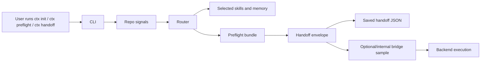

# skill-cassette Architecture

`skill-cassette` is a repo-owned handoff layer for agent-assisted work. Its job in v1 is narrow:

- inspect local repo signals
- choose a small set of skills and memory cards
- save an editable handoff artifact
- print an explicit next step for the user or backend

It is not a generic memory system, and v1 does not promise compaction or persistent memory recovery.

## System Shape

## Runtime Flow

1. The CLI reads task input from flags, issue text, or git state.
2. The router classifies the task as code or docs work.
3. The registry discovers matching repo-local skills and memory cards.
4. The composer turns the selected context into a human-readable bundle.
5. The backend layer shapes that bundle into a portable handoff envelope.
6. The CLI writes `.skill-cassette/handoff.json` and prints the next step.
7. The bridge sample stays optional/internal and is not the primary path.

## Main Modules

### `src/cli.js`

Owns the user-facing command flow:

- `ctx init`
- `ctx scan`
- `ctx doctor`
- `ctx preflight`
- `ctx handoff`
- `ctx explain`

It also handles:

- prompt handling
- saved handoff creation
- Codex auto-launch from the saved handoff
- blue-highlighted user guidance in TTY terminals

### `src/router.js`

Turns repo signals into a routing decision:

- task type
- confidence
- recommended skills
- recommended memory cards
- reasons for the selection

### `src/registry.js`

Loads repo-local skill manifests and memory cards.

This is the discovery layer for `skills/` and `memory/`.

### `src/composer.js`

Builds the preflight bundle and human-readable output.

This is where explainability lives, but not execution.

### `src/backends.js`

Shapes the preflight bundle into backend-specific handoff payloads.

v1 includes portable adapters for:

- `codex`
- `claude`
- `ollama`
- `generic`

### `src/scaffold.js`

Creates or refreshes the repo-local scaffold:

- `.skill-cassette.json`
- `.skill-cassette/handoff.json`
- `.skill-cassette/agent-bridge.mjs`
- starter skills
- starter memory cards
- starter workflow files

### `examples/wrappers/agent-bridge.mjs`

Optional/internal sample code only.

It exists as a reference wrapper for teams that want to build their own launcher pattern.
It is not the primary product path.

## Repo-Owned Artifacts

The repo owns the following artifacts:

- `skills/`
- `memory/`
- `.skill-cassette.json`
- `.skill-cassette/handoff.json`
- `.skill-cassette/agent-bridge.mjs`

The editable handoff file is the most important artifact for v1. It lets a user inspect or tweak the context before any backend runs.

## v1 Boundaries

These are intentional limits for the current release:

- local-first and read-only
- code and docs only
- backend handoff, not backend execution from the router
- Node-based CLI/runtime
- workspace-agnostic in product scope, but not all repos are first-class out of the box
- no promise of persistent memory compaction or recovery

## Contribution Guidance

If you want to contribute safely, keep changes inside one of these lanes:

1. Improve routing quality without changing the command surface.
2. Improve handoff readability without changing the artifact contract.
3. Improve scaffold output without making the product depend on the scaffold.
4. Add tests that lock the current behavior before changing user-facing text.

Avoid turning v1 into a broad memory platform. The product remains a handoff layer with an editable artifact and a clear next step.

## Suggested Contribution Areas

- Better skill matching heuristics
- Better memory ranking and explanation quality
- Better onboarding text in `ctx init`
- Better README and sample docs
- Better scaffold validation and tests

## What To Read Next

- `README.md`
- `src/cli.js`
- `src/router.js`
- `src/backends.js`
- `src/scaffold.js`
